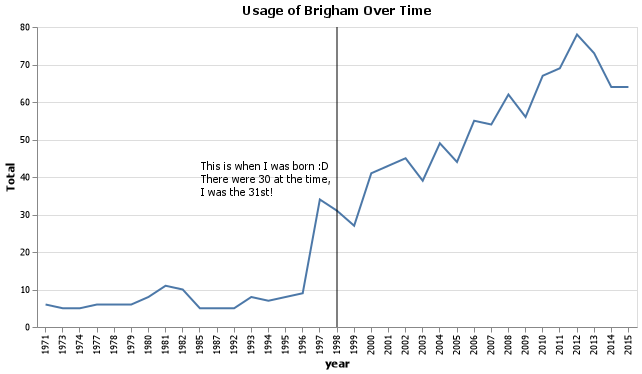
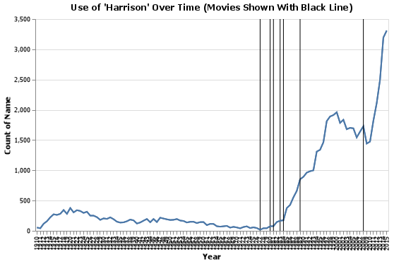

# Project 1: What's in a name?

__Brigham Eaquinto__


## Project Summary

_This analysis attempts to answer questions about the historic use of names. Graphs will show usage of specific names over time. The packages used are pandas, numpy, and altair._


#### Grand Question 1: How does your name at your birth year compare to its use historically?

It appears that after 1996, the use of this name increased sharply. While this is true it's still such a low volume of the name, it's not like it's taking over the world. 
Within 45 years the usage went from 6 per year to 78 per year!



#### Grand Question 2: If you talked to someone named Brittany on the phone, what is your guess of his or her age? What ages would you not guess?

 If I were to talk to someone named Brittany and we were to have a guess of her age, this visualization may help us out. 
 We see that the rate of people getting the name Brittany is in a gib decline. We see , if I were to take a guess, my guess would be from 21


#### Grand Question 3: Mary, Martha, Peter, and Paul are all Christian names. From 1920 to 2000, compare the name usage of each of the four names.

This visualization shows the usage of these names over time. Mary is the most prevalent. All four of the names have sharply decreased and are nothing to what they use to be compared to previous years.


#### Grand Question 4: Think of a unique name from a famous movie. Plot the usage of that name and see how changes line up with the movie release.

The Indiand Jones series proved very successful since it's debut in 1981 of _"Raiders of the Lost Arc"_ The main character, Indiana Jones, is played by Harrison Ford. At the release of the movie, the name was well below 100 names per year. After the movie became a big hit, the name increased sharply.




<br>
<br>

## Appendix: Code Script

```python
# Libraries
import pandas as pd
import altair as alt
import numpy as np
# alt.data_transformers.enable('json')
```

```python
# Read in data
dat = pd.read_csv("https://raw.githubusercontent.com/byuidatascience/data4names/master/data-raw/names_year/names_year.csv")

# Data info: https://github.com/byuidatascience/data4names/blob/master/data.md
```

```python
q1 = dat.query('name == "Brigham"')
q1_1 = dat[['name', 'year', 'Total']].query('name == "Brigham" & year == 1998')
```

```python
# Altair Charts

brigham_data = pd.DataFrame({
        "year":[1998],
        "name":["Brigham"],
        "label":["Birth Year"],
        "y":[80]
})

yearchart = (alt.Chart(q1)
                .mark_line()
                .encode(
                        x='year:O',
                        y='Total',)
                .properties(width = 600, title = "Usage of Brigham Over Time")
)
# yearchart

line = (alt.Chart(brigham_data)
                .mark_rule()
                .encode(x = alt.X("year:O"))
)

text = (alt.Chart(brigham_data)
        .mark_text(dx = -70, 
                   dy = -10, 
                   color = "black")
        .encode(
                x='year:O', 
                text = alt.condition(
                        'datum.year == 1998',
                        alt.value('This is when I was born :D \nThere were 30 at the time, \nI was the 31st!'),
                        alt.value('')
        ))
        .properties(width = 600, title = "Usage of Brigham Over Time")

)
# m1

bigchart = yearchart + line + text
bigchart

bigchart.save('gq1chart.png')

```

```python
brittany = (
    dat
    .query('name == "Brittany" and year > 1980')
    .assign(age = lambda x: abs(x.year - 2021) )
    .filter(["name", "year", "Total", "age"])
)
# brittany

brittany_chart = (
    alt.Chart(brittany)
    .mark_bar()
    .encode(
        x = alt.X('year:O'),
        y = alt.Y('Total:Q')
    )
    .properties(title = "Brittany Age")
)
# brittany_chart

brittany_chart.save('gq2chart.png')
```

```python
list3 = ["Mary", "Martha", "Peter", "Paul"]
dat3 = dat.query('name == @list3')

# q1 = dat.query('name == "Brigham"')
# q1_1 = dat.query('name == "Brigham" and year == "1998"')

chart3 = (
alt.Chart(dat3)
    .mark_line().encode(
        x = alt.X('year:O', axis = alt.Axis(title = "Year", format = 'd')),
        y = alt.Y('Total:Q', title = "Name Count"), 
        color = "name"
        )
        .properties(width = 500, title = "Martha, Mary, Paul, and Peter Names Over the Years")
)
chart3
# chart3.save('gq3chart.png')
```

```python
chart_4 = pd.DataFrame({
        "year1":[1981],
        "year2":[1984],
        "year3":[1989], 
        "year4":[2008]
})

dat3= (
    dat
    .query('name == "Harrison"')
    # .groupby('year')
    # .agg(total_year = ('name', sum))
)
# dat3

chart4 = (
alt.Chart(dat3)
    .mark_line()
        .encode(
        x = alt.X('year:O', title = "Year"),
        y = alt.Y('Total:Q', title = "Count of Name")
    )
    .properties(title = "Use of 'Harrison' Over Time (Movies Shown With Black Line)", width = 500)
)
# chart4

line1 = (alt.Chart(chart_4)
                .mark_rule()
                .encode(x = alt.X('year1:O'))
)

line2 = (alt.Chart(chart_4)
                .mark_rule()
                .encode(x = alt.X('year2:O'))
)

line3 = (alt.Chart(chart_4)
                .mark_rule()
                .encode(x = alt.X('year3:O'))
)

line4 = (alt.Chart(chart_4)
                .mark_rule()
                .encode(x = alt.X('year4:O'))
)

final_chart = chart4 + line1 + line2 + line3 + line4
final_chart

# final_chart.save('gq4chart.png')
```


