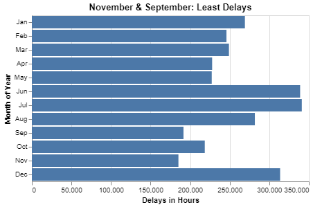
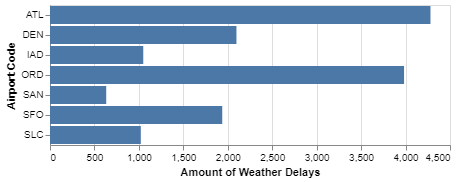

# Project 2: Are we missing JSON on our flight?

**Brigham Eaquinto**

## Project Summary

This report analyses airport data in five grand questions. Specifically it shows general stats on delays of flights from airports. 
One very informative plot shows the delays of flights per month (which shows summer time and holiday travels). 
Personally, I was very surprised on how many delays there were. The first plot shown adds all the hours of delays and dipicts them by month. It's surprising how many hours worth of delays there are.


## Technical Details

#### Grand Question 1
**Which airport has the worst delays?** Discuss how you chose to define “worst”. Your answer should also include a table that lists (for each airport) the total number of flights, total number of delayed flights, proportion of delayed flights, and average delay time in hours.


To define the _worst delays_, we will find the airport that has the highest percentage of delayed flights by taking the count of late flights in each airport and diving it by the count of total flights in that airport. 


|    | airport_code   |   total_flights |   total_delays |   total_delay_minutes |   prop_delays |   avg_delay_hours |   percent_delays |
|---:|:---------------|----------------:|---------------:|----------------------:|--------------:|------------------:|-----------------:|
|  0 | SFO            |         1630945 |         425604 |              26550493 |      0.260955 |          1.03972  |          26.0955 |
|  1 | ORD            |         3597588 |         830825 |              56356129 |      0.230939 |          1.13053  |          23.0939 |
|  2 | ATL            |         4430047 |         902443 |              53983926 |      0.20371  |          0.996996 |          20.371  |
|  3 | IAD            |          851571 |         168467 |              10283478 |      0.197831 |          1.01736  |          19.7831 |
|  4 | SAN            |          917862 |         175132 |               8276248 |      0.190804 |          0.78762  |          19.0804 |
|  5 | DEN            |         2513974 |         468519 |              25173381 |      0.186366 |          0.895495 |          18.6366 |
|  6 | SLC            |         1403384 |         205160 |              10123371 |      0.146189 |          0.822396 |          14.6189 |


#### Grand Question 2
**What is the best month to fly if you want to avoid delays of any length?** Discuss your answer. Include one chart to help support your answer, **with the x-axis ordered by month**. (To answer this question, you will need to remove any rows that are missing the Month variable.)




From this plot, we learn that SFO airport is the biggest offender of percent of their own flights delayed (almost 1/3 of yearly flights are delayed). This is be caused by many reasons but regardless, flights at the SFO airport can be expected to be delayed.


#### Grand Question 3
According to the BTS website, the “Weather” category only accounts for severe weather delays. Mild weather delays are not counted in the “Weather” category, but are actually included in both the “NAS” and “Late-Arriving Aircraft” categories. **Your job is to create a new column that calculates the total number of flights delayed by weather (both severe and mild).** You will need to replace all the missing values in the Late Aircraft variable with the mean. Use these three rules for your calculations:

100% of delayed flights in the Weather category are due to weather.
30% of delayed flights in the Late-Arriving category are due to weather.
From April to August, 40% of delayed flights in the NAS category are due to weather. The rest of the months, the proportion rises to 65%.  

|    | airport_code   | month   |   year |   total_number_weather_delayed_flights |
|---:|:---------------|:--------|-------:|---------------------------------------:|
|  0 | ATL            | January |   2005 |                                2619.93 |
|  1 | DEN            | January |   2005 |                                 885.4  |
|  2 | IAD            | January |   2005 |                                 736.4  |
|  3 | ORD            | January |   2005 |                                3148.5  |
|  4 | SAN            | January |   2005 |                                 515.2  |

This visualization shows the amount of accumulative delays in each month. It appears that the summer months are highest and the fall months are the lowest.


#### Grand Question 4

*Question 2 needs a DESCRIPTION of what you learned and a CHART.*



#### Grand Question 5

*Question 2 needs a DESCRIPTION of what you learned and one JSON RECORD (aka, one row of data from the JSON file). The record can be formatted as code:*

```
{
        "airport_code": "ATL",
        "airport_name": "Atlanta, GA: Hartsfield-Jackson Atlanta International",
        "month": "January",
        "year": 2005.0,
        "num_of_flights_total": 35048,
        "num_of_delays_carrier": null,
        "num_of_delays_late_aircraft": 1109.1040723982,
        "num_of_delays_nas": 4598,
        "num_of_delays_security": 10,
        "num_of_delays_weather": 448,
        "num_of_delays_total": 8355,
        "minutes_delayed_carrier": 116423.0,
        "minutes_delayed_late_aircraft": 104415,
        "minutes_delayed_nas": 207467.0,
        "minutes_delayed_security": 297,
        "minutes_delayed_weather": 36931,
        "minutes_delayed_total": 465533
    }
```

## Python Script 

```python
# Libraries
import pandas as pd   # to load and transform data
import numpy as np    # for math/stat calculations
import altair as alt
import json 


# Read in data
flights = pd.read_json("https://github.com/byuidatascience/data4missing/raw/master/data-raw/flights_missing/flights_missing.json")


# GQ 1


months = ["January", "Febuary", "March", "April", "May", "June", "July", "August", "September", "October", "November", "December"]

gq1 = (
flights.groupby('airport_code')
       .agg(total_flights = ('num_of_flights_total', sum), 
            total_delays = ('num_of_delays_total', sum), 
            total_delay_minutes = ('minutes_delayed_total', sum))
       .assign(prop_delays = lambda X: X.total_delays / X.total_flights, 
               avg_delay_hours = lambda X: X.total_delay_minutes / X.total_delays / 60, 
               percent_delays = lambda X: X.prop_delays * 100)
       .sort_values('prop_delays', ascending = False)
       .reset_index()
)
# gq1.pd.dataframe()
print(gq1.to_markdown())

chart1 = (
alt.Chart(gq1)
        .mark_bar().encode(
                x = alt.X('prop_delays:Q', title = "Percent of Flights Delayed", axis=alt.Axis(format = '%')), 
                y = alt.Y('airport_code:O', title = "Airport Code", sort='-x')
        )
        .properties(
                title = "San Fran Exects Delays"
        )
)
chart1


# GQ 2

flights3 = flights.replace(['n/a', "1500+", -999], np.nan)

gq2 = (
flights
     .replace(to_replace = "Febuary", value = "February")
     .dropna(subset = ['month'])
     .query("month != 'n/a'")
     .groupby('month')
     .agg(total_flights = ('num_of_flights_total', sum), 
          total_delays = ('num_of_delays_total', sum), 
          total_delay_minutes = ('minutes_delayed_total', sum)
     )
     .assign(total_delay_hours = lambda x: x.total_delay_minutes / 60)
     .reset_index()            
)

gq2 = (gq2.assign(month_number = pd.to_datetime(gq2.month, format = "%B").dt.month, 
                  month_date = pd.to_datetime(gq2.month, format = "%B"))
          .sort_values('month_number', ascending = False)
          .reset_index())

(alt.Chart(gq2)
.mark_bar()
.encode(
     x = alt.X('total_delay_hours:Q', title = 'Delays in Hours'), 
     y = alt.Y('month(month_date):O', title = 'Month of Year' 
     # sort = 'month_number'
     # sort = alt.EncodingSortField(field="months", order='ascending')
     ))
.properties(title = "November & September: Least Delays")
)

# GQ 3

late_aircraft_avg = flights.num_of_delays_late_aircraft.replace(-999, np.nan).mean()
q3 = flights
q3.num_of_delays_late_aircraft.replace(-999, late_aircraft_avg, inplace = True)
# q3

q3_new = (
    q3
    .assign(total_number_weather_delayed_flights = lambda x: x.         num_of_delays_late_aircraft * 0.3 + 
         x.num_of_delays_nas * 0.4 +
         x.num_of_delays_weather
    )
    # .sort_values('total_number_weather_delayed_flights')
    # .filter('total_number_weather_delayed_flights')
)
print(q3_new.filter(["airport_code", "month", "year", "total_number_weather_delayed_flights", ]).head().to_markdown())
# q3.head()


# GQ 4

(
    alt.Chart(q3_new)
    .mark_bar()
    .encode(x = alt.X('total_number_weather_delayed_flights:Q', title = "Amount of Weather Delays"), 
            y = alt.Y('airport_code:O', title = "Airport Code"))
)


weather = q3.assign(
    severe = q3.num_of_delays_weather, 
    mild_late = .3 * q3.num_of_delays_late_aircraft, 
    mild_nas = np.where(q3.month.isin(["April", "May", "June", "July", "August"]), 
                        .4 * q3.num_of_delays_nas, 
                        .65 * q3.num_of_delays_nas), 
    total_weather = lambda x: x.severe + x.mild_late + x.mild_nas, 
)

q4_data = (weather.groupby("airport_code")
                .agg(total_weather_delays = ('total_weather', sum),
                     total_flights = ("num_of_flights_total", sum))
                .assign(per_weather_delays = lambda x: x.total_weather_delays / x.total_flights)
                .reset_index())
q4_data.head()

# GQ 5

# Clean Data
flights= (
    flights
    .replace(['n/a', "1500+", -999], np.nan)
)

json_data = flights.to_json()
json_data = flights.to_json(orient = "records")
json_object = json.loads(json_data)
json_formatted_str = json.dumps(json_object, indent = 4)
print(json_formatted_str)


```