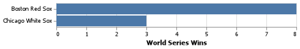

# Project 3: Finding Relationships In Baseball

__Brigham Eaquinto__


## Project Summary

_This report analyses statistics from baseball. Basic findings such are batting averages are explored. Students who attended BYU-Idaho who now play in the major leagues will be shown too! The final question will show who has won the most World Series between the two socks teams._


#### Grand Question 1: 

Write an SQL query to create a new dataframe about baseball players who attended BYU-Idaho. The new table should contain five columns: playerID, schoolID, salary, and the yearID/teamID associated with each salary. Order the table by salary (highest to lowest) and print out the table in your report.


#### Grand Question 2

This three-part question requires you to calculate batting average (number of hits divided by the number of at-bats):

*a) Write an SQL query that provides playerID, yearID, and batting average for players with at least 1 at bat that year. Sort the table from highest batting average to lowest, and then by playerid alphabetically. Show the top 5 results in your report.*


*b) Use the same query as above, but only include players with at least 10 at bats that year. Print the top 5 results.*


*c) Now calculate the batting average for players over their entire careers (all years combined). Only include players with at least 100 at bats, and print the top 5 results.*


#### Grand Question 3

*Pick any two baseball teams and compare them using a metric of your choice (average salary, home runs, number of wins, etc). Write an SQL query to get the data you need, then make a graph in Altair to visualize the comparison.*

Below we see that the Boston Red Sox team has won 5 more World Series's than the Chicago White Sox. Both are very prominant teams due to the famousness of their respective cities. It is common that the more money the team has, the better players they receive, and we can loosely infer that the Red Sox has more funding towards their baseball team. 




- _Write out the answer to each grand question, and describe your charts and tables. I highly recommend [Grammarly](https://grammarly.com/) to fix your spelling and grammar. Writing clearly takes time! Spend the time to practice._  

- _Provide charts that address the Grand Questions. The Markdown code to include images looks like this:_

```

```


- _Provide tables that address the Grand Questions. You can generate Markdown code for tables using the `to_markdown()` python command._

```
s = pd.Series(["elk", "pig", "dog", "quetzal"], name="animal")
print(s.to_markdown())
|    | animal   |
|---:|:---------|
|  0 | elk      |
|  1 | pig      |
|  2 | dog      |
|  3 | quetzal  |
```

|    | animal   |
|---:|:---------|
|  0 | elk      |
|  1 | pig      |
|  2 | dog      |
|  3 | quetzal  |

- _You might include small code snippets to highlight important calculations or decisions. You can use Markdown to format text like code using three backticks:_

````
```python
import numpy
import pandas

my variable = 5
```
````

```python
import numpy
import pandas

my variable = 5
```


## Appendix A

_This is where your python script will go. Your code should be commented and well organized._

```python
# paste your python script in here!
```