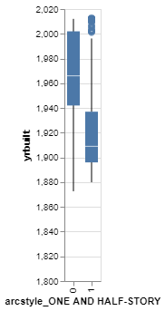
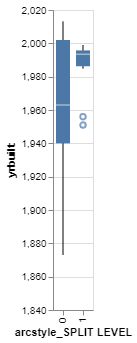
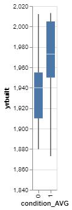

# Project 4: Classifying Homes

__Brigham Eaquinto__


## Project Summary

_The main focus of this analysis is about taking data about homes in Denver, Colorado and puts the information through a machine learning model to be able to predict if the house was built before or after 1980. Different measurement of success are taken into the conversation at the end of the article._


<br><br>


#### Grand Question 1
*Create 2-3 charts that evaluate potential relationships between the house variables and the variable before1980 Explain what you learn from the charts that could help a machine learning algorithm.*


The following chart helps us visualize that there may be a relationship between the year a house was built vs if the arc style of a house is one and a half stories. It's not a sure predictor, but it is a factor to contribute to finding out the year a house was built.  




This chart helps us see that there's a slight (pretty weak but still there) relationship between the year a house was built vs if the house arc style is a split level. 




This last chart shows that the there is a stronger relationship that a house is probably built before 1980 if the condition is not average. 




<br><br>

#### Grand Question 2
*Build a classification model labeling houses as being built “before 1980” or “during or after 1980”. Your goal is to reach 90% accuracy. Explain your final model choice (algorithm, tuning parameters, etc) and describe what other models you tried.*


In this machine learning model, I ultimately opted for a random forest model. I hear that this is often the best with machine learning. I achiever similiar results with a decision tree model but ended with the random forest model. 
The data is split at an 80:20 for training and testing. I did the kitchen sink approach in both methods for the features and it worked well because it achieved a 92% accuracy!

**Code for the model**

`features = dwellings_ml.drop(columns = ['before1980', 'yrbuilt','parcel'])`
`targets = dwellings_ml.before1980`
`x_train, x_test, y_train, y_test = train_test_split(features, targets, test_size = .20, random_state = 76)`
`classifier_DT.fit(x_train, y_train)`
`y_predicted = classifier_DT.predict(x_test)`
`metrics.accuracy_score(y_test, y_predicted)`


<br><br>

#### Grand Question 3

prin

Shown above are the 15 most useful features of the model. 
We as humans understand some factors that play into how mucha  house costs, but this helps us understand visually what is the most important (according to the data set in use). 
Often the first thing spoken is the square footage of the home, and the is the most important factor available to us here. "arcstyle_ONE-STORY" and stories are similar in the way the computer sees the information and it may be problematic is the regression usage, but it is certain that that is an important feature in determining when the house was built. 
The following are other features useful, one thing that surprises me is that the quality rating of the house does not play a bigger factor. 

Below are is the same information is a numerical format.

| features           |   importance |
|:-------------------|-------------:|
| livearea           |    0.0846190 |
| arcstyle_ONE-STORY |    0.0775971 |
| stories            |    0.0720474 |
| numbaths           |    0.0619312 |
| sprice             |    0.0579367 |


<br><br>

#### Grand Question 4

*Describe the quality of your classification model using 2-3 different evaluation metrics. You also need to explain how to interpret each of the evaluation metrics you use.*


Accuracy of model: **92.3%**

- this is similiar to the score on a test; the number of correct choices out of all.

Recall of model: **94.3%**

- recall's measurement of success focuses on the *actual positives* for cases revelant to that. It is the number of  true positives divided by the number of true positives plus the number of false negatives.

Precision of model: **93.5%**

- precision's measurement of success focuses on the *predicted positives* for cases revelant to that. It is the number of  true positives divided by the number of true positives plus the number of false positives.


For evaluating model performance, there is accuracy, precision, and recall.  The formulas are porvided below. 

Formulas: 

- Accuracy: (number of correct responses) / (total number of test cases)
- Recall: (number of true positives) / (number of true positives + number of false negatives)
- Precision: (number of true positives) / (number of true positives + number of false positives)


<br><br><br>


## Appendix A

_This is where your python script will go. Your code should be commented and well organized._

```python
# Set up


# Libraries
import pandas as pd
import altair as alt
import numpy as np
import xgboost

from sklearn.model_selection import train_test_split
from sklearn.naive_bayes import GaussianNB
from sklearn.tree import DecisionTreeClassifier
from sklearn import metrics
from sklearn import tree
from sklearn.ensemble import RandomForestClassifier
from sklearn.ensemble import GradientBoostingClassifier


denver_dwelling = pd.read_csv("https://github.com/byuidatascience/data4dwellings/raw/master/data-raw/dwellings_ml/dwellings_ml.csv")
dwellings_ml = pd.read_csv("https://github.com/byuidatascience/data4dwellings/raw/master/data-raw/dwellings_ml/dwellings_ml.csv")

alt.data_transformers.enable('json')


# GQ 1 

# chart 1; year built and arc style as one and a half
(
    alt.Chart(dwellings_ml)
    .mark_boxplot()
    .encode(
        y = alt.Y('yrbuilt:Q', 
        scale=alt.Scale(domain=[1800, 2020])
        ), 
        x = alt.X('arcstyle_ONE AND HALF-STORY:O')
        # , color = "before1980:O"
        )
)


# chart 2: year built vs arc style as a split level
(
    alt.Chart(dwellings_ml)
    .mark_boxplot()
    .encode(
        y = alt.Y('yrbuilt:Q', 
        scale=alt.Scale(domain=[1850, 2020])
        ), # zoom into the revelant years
        x = alt.X('arcstyle_SPLIT LEVEL:O')
        # , color = "before1980:O"
        )
)


# chart 3: year built vs condition being average
(
    alt.Chart(dwellings_ml)
    .mark_boxplot()
    .encode(
        y = alt.Y('yrbuilt:Q', 
        scale=alt.Scale(domain=[1850, 2020])
        ), # zoom into the revelant years
        x = alt.X('condition_AVG:O')
        # , color = "before1980:O"
        )
)


# GQ 2

# "X" or "independent"
features = dwellings_ml.drop(columns = ['before1980', 'yrbuilt','parcel'])

# "y" or "dependent" or "outcome"
targets = dwellings_ml.before1980
# targets must already be boolean (classification type)


# split the data!
x_train, x_test, y_train, y_test = train_test_split(features, targets, test_size = .20, random_state = 76)

classifier_DT = RandomForestClassifier(max_depth=30) #create a classification model
# classifier_DT = DecisionClassifier(max_depth=10)

# train the model
classifier_DT.fit(x_train, y_train)

# use your model to make predictions!
y_predicted = classifier_DT.predict(x_test)

# test how accurate those predictions are
metrics.accuracy_score(y_test, y_predicted)


# GQ 3

feat_importances = pd.Series(
    classifier_DT
    .feature_importances_, index=x_test
    .columns
)

significance_graph = (
    feat_importances
    .nlargest(15)
    .plot(kind='barh')
)
significance_graph


feature_df = pd.DataFrame({'features':features.columns, 'importance':classifier_DT.feature_importances_})

feature_importance = feature_df.sort_values('importance', ascending = False).head()

print(feature_importance.to_markdown())


gq2chart = (
alt.Chart(feature_importance)
.mark_bar()
.encode(
    x = alt.X("features:O", sort = "-y"),
    y = alt.Y("importance:Q")
))

gq2chart


# GQ 4

from sklearn.metrics import confusion_matrix

confusion_matrix = confusion_matrix(y_test, y_predicted)

confusion_matrix_df = pd.DataFrame(confusion_matrix, columns=["True Negatives", "False Positives"]).reset_index()
confusion_matrix_df

# Accuracy Score 

from sklearn.metrics import accuracy_score

accuracy = accuracy_score(y_test, classifier_DT.predict(x_test))
accuracy

# Recall Score
from sklearn.metrics import recall_score

recall = recall_score(y_test, y_predicted, average='binary')
recall

# Precision Score

from sklearn.metrics import precision_score
precision = precision_score(y_test, y_predicted, average='binary')
precision

from sklearn.metrics import classification_report

classification_report = classification_report(y_test, y_predicted)
print(classification_report)
# classification_report.pd.dataframe()

# classification_report_df = pd.DataFrame(classification_report, columns=["", "", "", "", "", ""]).reset_index()
# classification_report_df

```