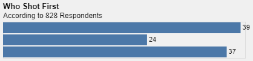
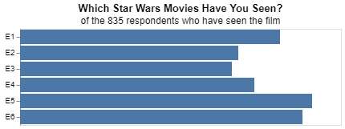

# Project 5: The war with Star Wars

__Brigham Eaquinto__


## Project Summary

_This analysis takes a survey dataset about the Star Wars movies to find common beliefs about the movies and ultimately uses the information to predict the average income of each person who took the survey._


<br>


#### Grand Question 1


In this question, we will use the provided survey dataset and make it into a useable dataset. Steps of how to do so are provided at the end of the analysis. 

**Data frame before wrangling**


|    | 0            | 1                                                            | 2                                                                     | 3                                                                                   | 4                                           | 5                                           | 6                                 | 7                                            | 8                                        | 9                                                                                                                                             | 10                                          | 11                                          | 12                                | 13                                           | 14                                       | 15                                                                                                             | 16             | 17                   | 18               | 19             | 20                | 21          | 22               | 23        | 24    | 25    | 26            | 27            | 28   | 29                          | 30                                           | 31       | 32                                                               | 33       | 34       | 35               | 36        | 37                       |
|---:|:-------------|:-------------------------------------------------------------|:----------------------------------------------------------------------|:------------------------------------------------------------------------------------|:--------------------------------------------|:--------------------------------------------|:----------------------------------|:---------------------------------------------|:-----------------------------------------|:----------------------------------------------------------------------------------------------------------------------------------------------|:--------------------------------------------|:--------------------------------------------|:----------------------------------|:---------------------------------------------|:-----------------------------------------|:---------------------------------------------------------------------------------------------------------------|:---------------|:---------------------|:-----------------|:---------------|:------------------|:------------|:-----------------|:----------|:------|:------|:--------------|:--------------|:-----|:----------------------------|:---------------------------------------------|:---------|:-----------------------------------------------------------------|:---------|:---------|:-----------------|:----------|:-------------------------|
|  0 | RespondentID | Have you seen any of the 6 films in the Star Wars franchise? | Do you consider yourself to be a fan of the Star Wars film franchise? | Which of the following Star Wars films have you seen? Please select all that apply. | nan                                         | nan                                         | nan                               | nan                                          | nan                                      | Please rank the Star Wars films in order of preference with 1 being your favorite film in the franchise and 6 being your least favorite film. | nan                                         | nan                                         | nan                               | nan                                          | nan                                      | Please state whether you view the following characters favorably, unfavorably, or are unfamiliar with him/her. | nan            | nan                  | nan              | nan            | nan               | nan         | nan              | nan       | nan   | nan   | nan           | nan           | nan  | Which character shot first? | Are you familiar with the Expanded Universe? | Do you consider yourself to be a fan of the Expanded Universe?ξ          | Do you consider yourself to be a fan of the Star Trek franchise? | Gender   | Age      | Household Income | Education | Location (Census Region) |
|  1 | nan          | Response                                                     | Response                                                              | Star Wars: Episode I  The Phantom Menace                                            | Star Wars: Episode II  Attack of the Clones | Star Wars: Episode III  Revenge of the Sith | Star Wars: Episode IV  A New Hope | Star Wars: Episode V The Empire Strikes Back | Star Wars: Episode VI Return of the Jedi | Star Wars: Episode I  The Phantom Menace                                                                                                      | Star Wars: Episode II  Attack of the Clones | Star Wars: Episode III  Revenge of the Sith | Star Wars: Episode IV  A New Hope | Star Wars: Episode V The Empire Strikes Back | Star Wars: Episode VI Return of the Jedi | Han Solo                                                                                                       | Luke Skywalker | Princess Leia Organa | Anakin Skywalker | Obi Wan Kenobi | Emperor Palpatine | Darth Vader | Lando Calrissian | Boba Fett | C-3P0 | R2 D2 | Jar Jar Binks | Padme Amidala | Yoda | Response                    | Response                                     | Response | Response                                                         | Response | Response | Response         | Response  | Response                 |


**Data frame after wrangling**

|    | 0                                                                |
|---:|:-----------------------------------------------------------------|
|  0 | respondentid                                                     |
|  1 | seen_any                                                         |
|  2 | is_fan_star_wars                                                 |
|  3 | seen__i__the_phantom_menace                                      |
|  4 | seen__ii__attack_of_the_clones                                   |
|  5 | seen__iii__revenge_of_the_sith                                   |
|  6 | seen__iv__a_new_hope                                             |
|  7 | seen__v_the_empire_strikes_back                                  |
|  8 | seen__vi_return_of_the_jedi                                      |
|  9 | film_rank_i__the_phantom_menace                                  |
| 10 | film_rank_ii__attack_of_the_clones                               |
| 11 | film_rank_iii__revenge_of_the_sith                               |
| 12 | film_rank_iv__a_new_hope                                         |
| 13 | film_rank_v_the_empire_strikes_back                              |
| 14 | film_rank_vi_return_of_the_jedi                                  |
| 15 | favorable_characterhan_solo                                      |
| 16 | favorable_characterluke_skywalker                                |
| 17 | favorable_characterprincess_leia_organa                          |
| 18 | favorable_characteranakin_skywalker                              |
| 19 | favorable_characterobi_wan_kenobi                                |
| 20 | favorable_characteremperor_palpatine                             |
| 21 | favorable_characterdarth_vader                                   |
| 22 | favorable_characterlando_calrissian                              |
| 33 | gender                                                           |
| 34 | age                                                              |
| 35 | household_income                                                 |
| 36 | education                                                        |
| 37 | location_(census_region)                                         |
 
<br>


#### Grand Question 2

First recreated visual:



Second recreated visual: 



First recreated summary: 

This numerical summary see how many females that have seen at least one movie is a fan of the series. 60% are fans while 40% are not fans. This is the code for it:


`summary_1 = (sw_data.query("gender == 'Female' & seen_any == 'Yes'")`
`        .is_fan_star_wars`
`        .value_counts(normalize = True))`

`summary_1`

And here is the output: 

`Yes    0.599496`
`No     0.400504`
`Name: is_fan_star_wars, dtype: float64`


Second recreated summary:
The numerical summary recreates, "Seventy-nine percent of those respondents said they had watched at least one of the “Star Wars” films".

Here is the code for it:

`(sw_data.seen_any. value_counts(normalize = True).round(2)*100)`

Here is the output:

`Yes    79.0`
`No     21.0`
`Name: seen_any, dtype: float64`


<br>


#### Grand Question 3

Part A: Filter the dataset to respondents that have seen at least one film.
`q3 = sw_data.query('seen_any == "Yes"')`

Part B: Create a new column that converts the age ranges to a single number. Drop the age range categorical column.
`ml_age = (q3.age`
`   .str.replace("> ", "")`
`   .str.split("-", expand = True)`
`   .rename(columns = {0: "age_min", 1: "age_max"}) # this makes altair happy because they don't like integers as column names`
`   .age_min`
`   .astype("float"))`

Part C: Create a new column that converts the school groupings to a single number. Drop the school categorical 
column.
`ml_school = (q3.education`
`        .str.replace('Less than high school degree', '9')`
`        .str.replace('High school degree', '12')`
`        .str.replace('Some college or Associate degree', '14')`
`        .str.replace('Bachelor degree', '16')`
`        .str.replace('Graduate degree', '20')`
`        .astype('float'))`


Part D: Create a new column that converts the income ranges to a single number. Drop the income range categorical 
column.
`ml_income = (q3.household_income`
`   .str.replace("\$|,|\+", "")`
`   .str.split(" - ", expand=True)`
`   .rename(columns = {0: "income_min", 1: "income_max"}) # this makes altair happy because they don't like integers as column names`
`   .income_min`
`   .astype("float"))`


Part E: Create your target (also known as "y" or "label") column based on the new income range column.
`ml_dummies = pd.get_dummies(q3.filter(`
`    [ 'seen_any', 'is_fan_star_wars',`
`       'seen__i__the_phantom_menace', 'seen__ii__attack_of_the_clones',`
`       'seen__iii__revenge_of_the_sith', 'seen__iv__a_new_hope',`
`       'seen__v_the_empire_strikes_back', 'seen__vi_return_of_the_jedi',`
`       'favorable_characterhan_solo',`
`       'favorable_characterluke_skywalker',`
`       'favorable_characterprincess_leia_organa',`
`       'favorable_characteranakin_skywalker',`
`       'favorable_characterobi_wan_kenobi',`
`       'favorable_characteremperor_palpatine',`
`       'favorable_characterdarth_vader',`
`       'favorable_characterlando_calrissian',`
`       'favorable_characterboba_fett', 'favorable_characterc-3p0',`
`       'favorable_characterr2_d2', 'favorable_characterjar_jar_binks',`
`       'favorable_characterpadme_amidala', 'favorable_characteryoda',`
`       'shot_first', 'familiar_expanded_universe',`
`       'do_you_consider_yourself_to_be_a_fan_of_the_expanded_universe?ξ',`
`       'do_you_consider_yourself_to_be_a_fan_of_the_star_trek_franchise?',`
`       'gender', 'location_(census_region)']))`


Part F: One-hot encode all remaining categorical columns.
`target = starwars_ml.income_min >= 50000`


<br>

#### Grand Question 4

Build a machine learning model that predicts whether a person makes more than $50k. Describe your model and report the accuracy.

`features = starwars_ml.drop(columns = ['income_min'])`
`x_train, x_test, y_train, y_test = train_test_split(features, target, test_size = .34, random_state = 76)`
`x_train = pd.get_dummies(x_train).fillna(0)`
`classifier_RF = RandomForestClassifier(max_depth=12)`
`classifier_RF.fit(x_train, y_train)`
`y_predicted = classifier_RF.predict(x_test)`
`print(f"The model is useful {metrics.accuracy_score(y_test, y_predicted).round(2)*100}% of the time")`

Output: 
`The model is useful 65.0% of the time`


<br>


## Code Appendix 


```python

# Set up

# libraries
import pandas as pd
import altair as alt
import numpy as np


url = 'https://github.com/fivethirtyeight/data/raw/master/star-wars-survey/StarWars.csv'

sw_cols = pd.read_csv(url, encoding = "ISO-8859-1", header = None, nrows = 2)
sw_data = pd.read_csv(url, encoding = "ISO-8859-1", header = None, skiprows = 2) 

# Grand Question 1

bob = (sw_cols
       .iloc[0,:]
       .replace("Have you seen any of the 6 films in the Star Wars franchise?", "seen_any")
       .replace("Do you consider yourself to be a fan of the Star Wars film franchise?", "is_fan_star_wars")
       .replace("Which of the following Star Wars films have you seen? Please select all that apply.", "seen_")
       .replace("Please rank the Star Wars films in order of preference with 1 being your favorite film in the franchise and 6 being your least favorite film.", "film_rank")
       .replace("Please state whether you view the following characters favorably, unfavorably, or are unfamiliar with him/her.", "favorable_character")
       .replace("Which character shot first?", "shot_first")
       .replace("Are you familiar with the Expanded Universe?", "familiar_expanded_universe")
       .str.lower()
       .str.replace(" ", "_")
       .ffill()
) 
# bob


mary = (sw_cols
        .iloc[1,:]
        .replace("Response", "")
        .str.replace("Star Wars: Episode", "")
        .str.lower()
        .str.replace(" ", "_")  #partial match, not full match
        .fillna("") #replace function specifically for NA values
)
# mary


new_column_names = bob + mary
# new_column_names.head()


sw_data.columns = new_column_names

sw_data.head()
8912
# now we have our data set


# Grand Question 2

# First Recreated Visual

shot = (sw_data['shot_first']
        .dropna()
        .value_counts(normalize = True)
        .reset_index()
        )

shot["percent"] = round(shot['shot_first']*100, 0) 

shot


part1 = (alt.Chart(shot)
            .mark_bar()
            .encode(
                x = alt.X('shot_first', 
                          axis = None), 
                y = alt.Y('index', 
                          sort = ["Han", "Greedo", "I don't understand this question"], 
                          axis = None)
    )
)
# part1


part2 = (alt.Chart(shot)
            .mark_text(
                align = 'left', baseline = 'middle', dx = 3
                )
            .encode(
                x = 'shot_first', 
                y = alt.Y('index', 
                        sort = ["Han", "Greedo", "I don't understand this question"]), 
                        text = "percent")
        )
# part2


(part1 + part2).properties(
    title = {
        "text": ["Who Shot First"], 
        "subtitle": ["According to 828 Respondents"]
    }
).configure(
    background = "#f0f0f0"
).configure_title(
    anchor = "start"
)


# Second Recreated Visual

plot_2_data = (sw_data.query('seen_any == "Yes"')
                      .dropna(
                          subset = ['seen__i__the_phantom_menace',
                                    'seen__ii__attack_of_the_clones',
                                    'seen__iii__revenge_of_the_sith',
                                    'seen__iv__a_new_hope',
                                    'seen__v_the_empire_strikes_back',
                                    'seen__vi_return_of_the_jedi'],
                                    how = "all")
)
# plot_2_data


d3 = (pd.get_dummies(plot_2_data))
# d3


d4 = d3.filter(d3.columns[10:16])
# d4


percent = round( ((d4.sum() / len(d4.index)) * 100))
# percent


d5 = (plot_2_data.filter(like = "seen__", axis = 1)
)
# d5


d6 = (pd.melt(d5).groupby("value").count().reset_index())
# d6


d7 = (d6.assign(percent = lambda x: x.variable/len(plot_2_data)))
# d7


sw_renamed = percent.rename({
    "seen__i__the_phantom_menace_Star Wars: Episode I  The Phantom Menace": "E1", 
    "seen__ii__attack_of_the_clones_Star Wars: Episode II  Attack of the Clones": "E2", 
    "seen__iii__revenge_of_the_sith_Star Wars: Episode III  Revenge of the Sith": "E3", 
    "seen__iv__a_new_hope_Star Wars: Episode IV  A New Hope": "E4", 
    "seen__v_the_empire_strikes_back_Star Wars: Episode V The Empire Strikes Back": "E5", 
    "seen__vi_return_of_the_jedi_Star Wars: Episode VI Return of the Jedi": "E6"
})


sw_df = sw_renamed.to_frame()


final_sw_dat = sw_df.rename(columns = {0:"percent"})


p1_answer = (alt.Chart(final_sw_dat.reset_index())
                .mark_bar()
                .encode(alt.X('percent:Q', axis = None), 
                        alt.Y('index', title = ""))
                .properties(
                    title = {
                        "text": "Which Star Wars Movies Have You Seen?", 
                        "subtitle": "of the 835 respondents who have seen the film"
                    }
                ))

p1_answer


# First recreated Summary

summary_1 = (sw_data.query("gender == 'Female' & seen_any == 'Yes'")
        .is_fan_star_wars
        .value_counts(normalize = True))

summary_1


# Second recreated summary

# "Seventy-nine percent of those respondents said they had watched at least one of the “Star Wars” films"

(sw_data.seen_any. value_counts(normalize = True).round(2)*100)


# Grand Question 3

# A) Filter the dataset to respondents that have seen at least one film.

q3 = sw_data.query('seen_any == "Yes"')
# q3.head()


# B) Create a new column that converts the age ranges to a single number. Drop the age range categorical column.

ml_age = (q3.age
   .str.replace("> ", "")
   .str.split("-", expand = True)
   .rename(columns = {0: "age_min", 1: "age_max"}) # this makes altair happy because they don't like integers as column names
   .age_min
   .astype("float")
)
# ml_age


# C) Create a new column that converts the school groupings to a single number. Drop the school categorical column.

ml_school = (q3.education
        .str.replace('Less than high school degree', '9')
        .str.replace('High school degree', '12')
        .str.replace('Some college or Associate degree', '14')
        .str.replace('Bachelor degree', '16')
        .str.replace('Graduate degree', '20')
        .astype('float')
        )
# ml_school


# D) Create a new column that converts the income ranges to a single number. Drop the income range categorical column.

ml_income = (q3.household_income
   .str.replace("\$|,|\+", "")
   .str.split(" - ", expand=True)
   .rename(columns = {0: "income_min", 1: "income_max"}) # this makes altair happy because they don't like integers as column names
   .income_min
   .astype("float")
)
# ml_income


# E) One-hot encode all remaining categorical columns.

# sw_data.columns
# q3.columns

ml_dummies = pd.get_dummies(q3.filter(
    [ 'seen_any', 'is_fan_star_wars',
       'seen__i__the_phantom_menace', 'seen__ii__attack_of_the_clones',
       'seen__iii__revenge_of_the_sith', 'seen__iv__a_new_hope',
       'seen__v_the_empire_strikes_back', 'seen__vi_return_of_the_jedi',
       'favorable_characterhan_solo',
       'favorable_characterluke_skywalker',
       'favorable_characterprincess_leia_organa',
       'favorable_characteranakin_skywalker',
       'favorable_characterobi_wan_kenobi',
       'favorable_characteremperor_palpatine',
       'favorable_characterdarth_vader', 'favorable_characterlando_calrissian',
       'favorable_characterboba_fett', 'favorable_characterc-3p0',
       'favorable_characterr2_d2', 'favorable_characterjar_jar_binks',
       'favorable_characterpadme_amidala', 'favorable_characteryoda',
       'shot_first', 'familiar_expanded_universe',
       'do_you_consider_yourself_to_be_a_fan_of_the_expanded_universe?ξ',
       'do_you_consider_yourself_to_be_a_fan_of_the_star_trek_franchise?',
       'gender', 'location_(census_region)']
       )) # copy and paste all columns from columns above. See picture on phone. This is where I need help wrangling things from the lab
# print(ml_dummies)


starwars_ml = pd.concat([ml_dummies, 
                         q3.filter(['film_rank_i__the_phantom_menace', 'film_rank_ii__attack_of_the_clones',
                                    'film_rank_iii__revenge_of_the_sith', 'film_rank_iv__a_new_hope',
                                    'film_rank_v_the_empire_strikes_back',
                                    'film_rank_vi_return_of_the_jedi']),
                         ml_age, 
                         ml_school, 
                         ml_income], axis=1).dropna()

# starwars_ml.head()


# F) Create your target (also known as "y" or "label") column based on the new income range column.

target = starwars_ml.income_min >= 50000


# Grand Question 4


from sklearn.ensemble import RandomForestClassifier
from sklearn.model_selection import train_test_split
from sklearn import metrics


# "X" or "independent"
features = starwars_ml.drop(columns = ['income_min'])
# features

# split the data!
x_train, x_test, y_train, y_test = train_test_split(features, target, test_size = .34, random_state = 76)

x_train = pd.get_dummies(x_train).fillna(0)

# create a classification model
classifier_RF = RandomForestClassifier(max_depth=12)

# train the model
classifier_RF.fit(x_train, y_train)

# use your model to make predictions!
y_predicted = classifier_RF.predict(x_test)

# test how accurate those predictions are
print(f"The model is useful {metrics.accuracy_score(y_test, y_predicted).round(2)*100}% of the time") 


```